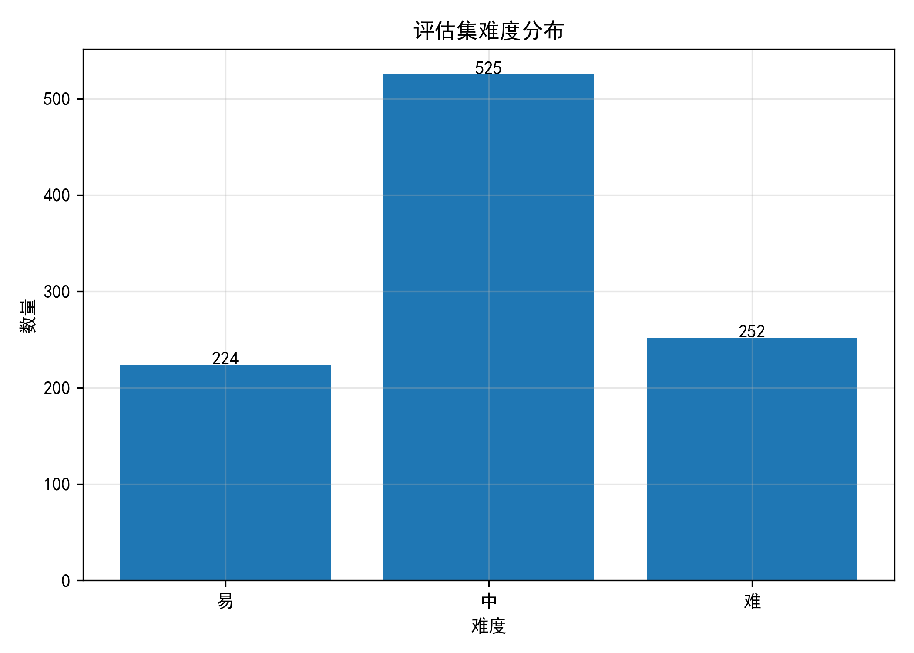
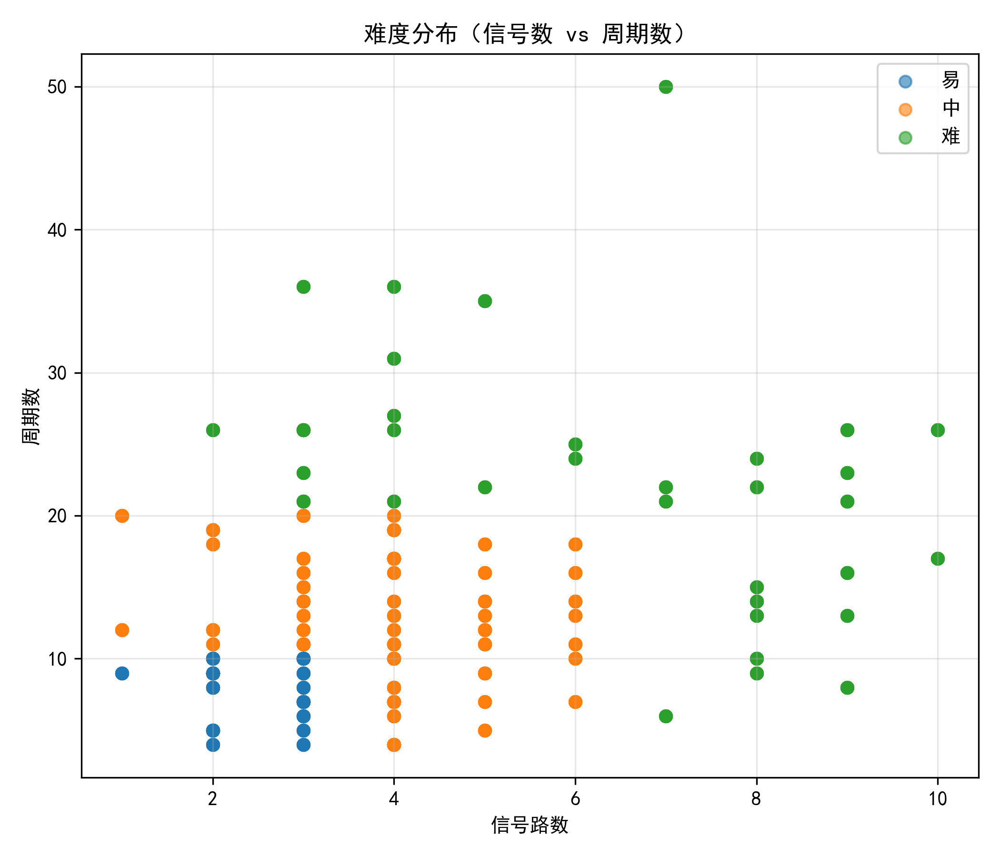
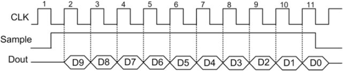
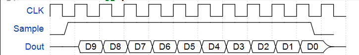

# 数据集说明

## 1. 数据来源

本数据集的原始样本均来源于真实电子工业场景中的时序图与波形图，主要包括以下几类：

1. **主流芯片 Datasheet（数据手册）**
   包括各类传感器、存储器及接口芯片的官方技术文档，例如 SPI、I²C、UART、EEPROM、Flash 等常见器件的数据手册。

2. **总线协议标准文档**
   包含少量高级系统总线协议的官方规范图表，例如 ARM AMBA 体系中的 AXI、AHB、APB 等协议时序图。

3. **数字电路教材与公开课件**
   用于补充基础逻辑电路相关波形，包括组合逻辑、时序逻辑、触发器等典型教学案例，同时包含少量手绘风格图片，以增强模型对非标准图像的适应能力。

数据整体覆盖了工业文档、教学资料以及复杂协议图等多种来源，能够较好地反映真实工程环境中的波形图特征。

---

# 2. 数据规模与扩增策略

本数据集以 **143 张高质量原始波形图** 为基础构建。

为了提升模型在复杂工程环境下的鲁棒性与泛化能力，针对原始样本进行了多种数据增强操作，以模拟实际文档采集、扫描、截图及拍照过程中可能出现的图像退化现象。增强方式主要包括：

* 高斯模糊
* 随机噪声扰动
* 透视变换
* 局部遮挡
* 水印叠加
* 随机直线干扰

通过上述增强策略，数据集能够覆盖从高质量电子文档到低质量真实拍照场景的多种输入情况，从而更有效地评估模型在复杂条件下的识别性能。

---

# 3. 类别分布

根据波形语义特征，数据集中的信号主要划分为以下三类：

1. **时钟信号（Clock Signals）**
   具有明显周期性翻转特征，通常用于同步时序逻辑，例如 SPI 时钟、系统时钟等。

2. **总线/数据信号（Bus/Data Signals）**
   包含多比特数据标注或总线状态信息，通常伴随数据字段、地址字段及状态切换，例如数据总线、地址总线等。

3. **普通控制信号（General Signals）**
   除上述两类之外的普通逻辑控制信号，例如片选信号（CS）、使能信号（EN）、复位信号（RESET）等。

该分类方式能够覆盖绝大多数数字电路与通信协议中的典型波形类型。

---

# 4. 难度分析

为了评估模型在不同复杂度场景下的泛化能力与鲁棒性，本文采用基于**结构复杂度**的难度评估方法，从以下两个维度对 WaveDrom 波形图进行划分：

* **信号路数（Signal Count）**
* **周期长度（Cycle Count）**

依据上述指标，将数据划分为“易”、“中”、“难”三级，具体标准如下：

|    难度等级   | 信号数 |  周期数 |
| :-------: | :-: | :--: |
|  易（Easy）  | ≤ 3 | ≤ 10 |
| 中（Medium） | ≤ 6 | ≤ 20 |
|  难（Hard）  | > 6 | > 20 |

其中：

* 信号数量越多，模型需要同时理解的上下文关系越复杂；
* 周期长度越长，波形结构越冗长，对模型的长序列建模能力要求越高。

下图分别展示了数据集的难度分布情况与复杂度散点分布：

---

# 5. 标签说明

数据集采用 WaveDrom 标准波形语法进行标注。主要标签定义如下：

|  标签字符 | 含义               | 视觉特征                     |
| :---: | :--------------- | :----------------------- |
|  `0`  | 低电平              | 位于最下方的一条实线               |
|  `1`  | 高电平              | 位于最上方的一条实线               |
|  `z`  | 高阻态       | 位于中间位置的线，部分主题显示为虚线       |
|  `x`  | 未知状态    | 带斜线阴影的交叉区域               |
|  `d`  | 弱低电平     | 下方虚线（极少使用）               |
|  `u`  | 弱高电平    | 上方虚线（极少使用）               |
|  `=`  | 有效数据 | 多边形数据框，可配合 `data: []` 使用 |
|  `p`  | 正沿时钟             | 一个完整的低到高方波周期             |
|  `n`  | 负沿时钟             | 一个完整的高到低方波周期             |
|  `P`  | 带箭头正沿时钟          | 在上升沿带箭头的正沿时钟             |
|  `N`  | 带箭头负沿时钟          | 在下降沿带箭头的负沿时钟             |
| `h/H` | 高频时钟             | 周期密度高于普通时钟               |
| `l/L` | 低频时钟             | 周期长度大于普通时钟               |
|  `.`  | 延续上一状态           | 将前一状态延长一个周期              |
|  `\|` | 时间省略标记           | 用于表示时间轴截断                |

此外：

* `0/1` 通常具有明显的上升沿与下降沿；
* `h/l` 更多用于表示理想化时钟电平状态；
* `=` 可用于表示总线数据区域，当 `data` 数组为空时仅显示为空白数据框。

---

# 6. 标签标注流程与质量控制

为保证评估集数据的权威性、准确性与一致性，所有原始图片均采用**高标准人工标注**方式完成。针对评委与社区关切的标注质量问题，我们制定了以下严格规范：

### 6.1 标注人员
评估集的标注工作全部由 **有数字电子技术背景的研究人员** 负责。对 SPI、I2C、AXI 等常见工业总线协议以及各类器件数据手册有着深刻理解，能够准确识别低质量扫描件或拍照图中的各种时序细节（如高阻态、不定态、亚稳态等），从源头上保证了“标注准确性”。

### 6.2 标注工具
本项目全程使用 **[WaveDrom 官方在线可视化编辑器](https://wavedrom.com/editor.html)** 作为核心标注与校验工具。标注人员在左侧编写 WaveDrom DSL JSON 语法的过程中，右侧能够实时、精准地渲染出 SVG 波形图，实现“所见即所得”，极大地避免了语法错误和肉眼难以察觉的时序错位。

### 6.3 质量控制机制
我们引入了**“交叉盲审 + 逆向重绘比对”**的双重质量校验机制，实现了真正意义上的“零幻觉”真值：
1. **初次标注与人工核对**：标注人员A基于原始波形图进行解析并编写对应标签。
2. **交叉盲审裁决**：由未参与初标的标注人员B进行二次校验。若两者的解析结果存在任何分歧（如某个时钟周期的占空比、高阻态的起止时刻），交由第三名资深人员C进行最终裁决。
3. **逆向重绘像素级比对**：将最终的 WaveDrom JSON 导入渲染引擎重新生成波形图。将**重绘结果与原始图片进行逐项叠加与比对**。确认波形结构、状态翻转边沿、数据标注内容及相对时间关系均 100% 保持一致后，方可正式纳入评估集。

---

原始图片示例：

基于人工标签通过 WaveDrom 重绘验证后的结果：

通过“高规格标注人员把关 + 专业工具辅助 + 交叉校验与重绘比对”的全流程控制，可以保证本评估集具有极高的标注质量与学术参考价值。
