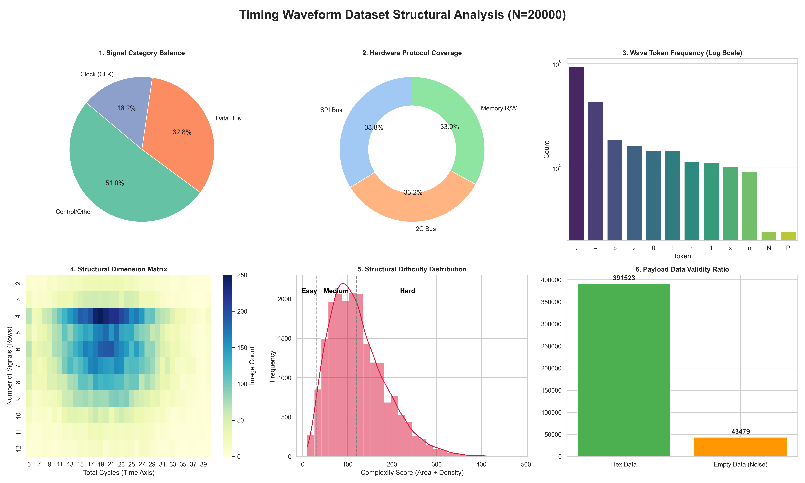
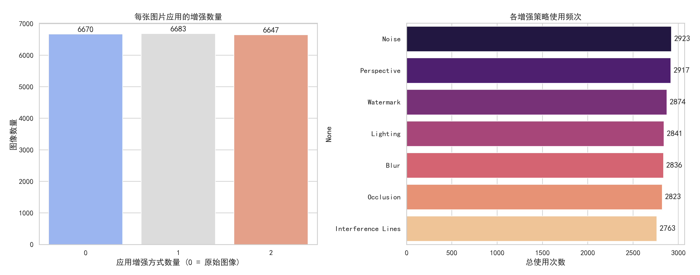

本数据集专为复杂工业场景下的逻辑时序图结构化识别任务构建。考虑到真实世界中时序图数据获取成本高、标注极易出错且存在严重的数据孤岛问题，本项目摒弃了传统的人工收集与手工标注方式，取而代之的是，利用wavedrom实现自动合成数据集。该系统不仅能通过严格的统计学分布生成具备高度逻辑自洽性的标准工业协议（如 SPI、I2C、Memory 总线等），还能通过构建包含7种特性的物理退化池，最终实现海量、多样、且绝对准确的高质量数据集构建。

---

## 1 数据采集与合成方法
本数据集的数据 100% 来源于自主合成引擎，主要分为**逻辑拓扑生成层**与**物理视觉退化层**两个核心阶段。

### 1.1 逻辑拓扑与协议生成层
为了确保合成时序图具备真实的工程意义，在生成逻辑时并未采用简单的纯随机策略，而是内置了工业界常用的总线协议引擎。
*   **统计学约束分布**：为保证数据尺度的多样性与合理性，时序图的总周期数严格服从正态分布 $\mathcal{N}(20, 7^2)$（截断范围 5~40），目标总线信号路数服从正态分布 $\mathcal{N}(6, 2.5^2)$（截断范围 1~12）。
*   **协议特征级保真**：引擎能够自动生成符合真实硬件规范的 SPI（极性与相位动态适配）、I2C（启动/停止位握手逻辑）以及带地址/数据相位的 Memory 读写时序，并注入由背景干扰信号构成的噪声通道。


| 图号 | 名称 | 说明 |
|------|------|-------------|
| 图1 | 信号分类比例 | 展示时钟、数据总线和控制信号的占比，保证分布与评估集一致 |
| 图2 | 硬件协议分布 | 展示I2C、SPI等不同总线协议的比例，体现数据集的应用广泛性。 |
| 图3 | 波形符号词频 | 以对数坐标展示波形字符的出现频次，反映信号描述的特征丰富度。 |
| 图4 | 结构维度矩阵 | 用热力图呈现（信号数 × 时间周期数）的样本密度。 |
| 图5 | 结构难度分布 | 直方图展示复杂度分数分布并划分难度等级（划分等级标准与评估集划分难度等级标准一致）。 |
| 图6 | 总线数据 | 对比总线信号中有效数据与空数据的数量。 |

### 1.2 物理视觉退化层
针对实地拍摄设备可能面临的复杂环境，每张生成的标准矢量图会被转换为 RGB 矩阵，并随机触发 0~2 种退化策略，以模拟真实的物理信道噪声：
1.  **Perspective (仿射透视失真)**：模拟非正交视角的倾斜拍摄。
2.  **Blur (光学散焦)**：模拟设备对焦失败或镜头起雾。
3.  **Noise (高频传感器噪声)**：模拟暗光条件下的 CMOS 噪点。
4.  **Lighting (非均匀光照)**：模拟外部光源造成的曝光过度或不足。
5.  **Occlusion (局部遮挡)**：模拟纸张污渍或屏幕坏点。
6.  **Interference Lines (干扰纹理)**：模拟纸张折痕或显示器摩尔纹。
7.  **Watermark (防伪水印)**：植入旋转缩放自适应的半透明工业防伪水印。


### 1.3 关键合成代码展示
以下代码展示了合成数据的核心模块：

```python
# [关键代码片段 1]：SPI 协议逻辑生成
def protocol_spi(total_len, used_names):
    # 动态适应正态分布产生的可变周期长度，防止极端情况下越界
    start = random.randint(1, max(1, total_len // 4))
    end = random.randint(1, max(1, total_len // 4))
    active = max(1, total_len - start - end)
    
    # 随机生成时钟极性(CPOL)、边沿特性及数据相位
    cpol, clk_char, data_phase = random.choice(['0', '1']), random.choice(['p', 'n', 'P', 'N']), random.choice([0, 0.5])
    
    # 严格截取并贴合到 total_len
    cs_wave = ("1" * start + "0" * active + "1" * end)[:total_len]
    clk_wave = (cpol * start + clk_char * active + cpol * end)[:total_len]
    m_wave = ("z" * start + "=" * active + "z" * end)[:total_len]

    signals = [{"name": random.choice(["CSn", "SS", "NSS"]), "wave": cs_wave},
               {"name": random.choice(["SCK", "SCLK", "CLK"]), "wave": clk_wave},
               {"name": "MOSI", "wave": m_wave, "data": populate_data(m_wave)}]
    return signals

# [关键代码片段 2]：图像渲染与复合物理退化管道
def apply_physical_degradation(cv_img, augment_pool, aug_names):
    # 限制单张图片最多叠加 2 种退化，防止特征完全破坏
    num_aug = random.randint(0, 2)
    selected_aug_names = random.sample(aug_names, num_aug)
    
    # 依次应用选定的物理退化算子
    for name in selected_aug_names:
        cv_img = augment_pool[name](cv_img)
        
    return cv_img, num_aug, selected_aug_names
```

---

## 2. 标注规范
由于采用纯合成策略，本数据集无需借助传统的人工标注工具。在生成数据的同时即可完成标注工作，可实现即精确又快速的标记。标注规范采用结构化 JSON/字典格式（存储为 `.txt`），直接反映数字电路的底层逻辑。标注文件结构包含 `signal` 列表，每条信号路的标注字段如下：
*   **`name`** : 信号引脚名称（如 "SCL", "MOSI", "RSTn"）。
*   **`wave`** : 核心时序波形序列，采用 WaveDrom 标准波形语法进行标注（wavedrom标准波形语法可见`数据集说明.md`文档）
*   **`data`** (List): 当波形包含 `=` 时，对应总线传输的具体数据（如 "0x4F", "0xA1"等）。
*   **`phase`** (Float): 数据对齐的相位偏移值（如 0.5），用于标记边沿采样关系。


