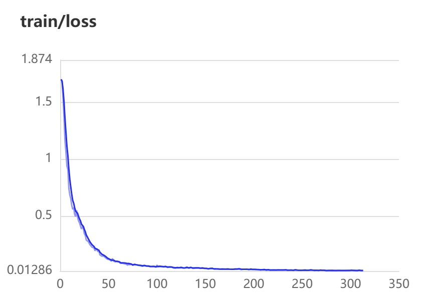
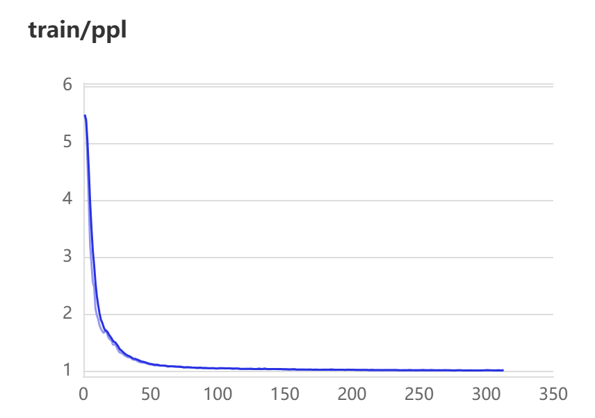
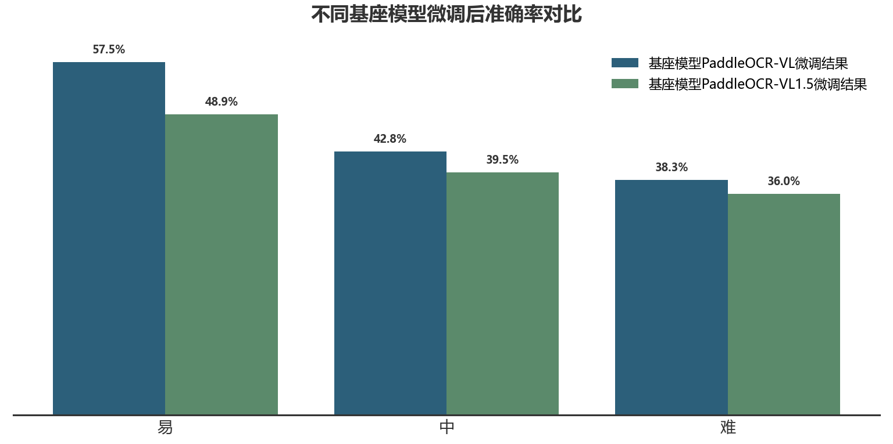
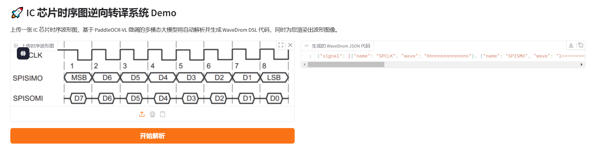

# IC Waveform to WaveDrom DSL Translator 
**基于多模态大模型的 IC 芯片时序图逆向转译系统**

[](https://opensource.org/licenses/MIT)
[]()
[]()

## 项目背景与目标

在集成电路（IC）设计与验证领域，技术文档（Datasheet）和协议规范中包含了大量的时序信号波形图。随着大语言模型的普及，工程师希望通过模型快速解析硬件文档。然而，**现有的多模态大模型乃至专用 OCR 模型，普遍难以准确解析波形图的时序语义信息**（例如：高低电平翻转、高阻态、数据周期等），从而极大地限制了模型对硬件底层逻辑的理解。

本项目旨在研究并实现 **“IC芯片时序图到 WaveDrom DSL 的逆向转译”**。
通过将原始波形图片（含数字截图、屏幕拍照、白板手绘等）逆向转换为符合 WaveDrom 规范的结构化 JSON 描述文件。将转换后的 DSL 馈送至 LLM，可弥补现有模型在时序波形识别方面的短板，打通大模型在 EDA 和数字 IC 领域的视觉通道。

---

## 核心特性

- **自动化合成训练集与高精度人工标注评估集**：**针对训练集**，利用内置工业总线协议引擎（SPI, I2C, Memory等）实现自动化合成，摒弃高成本人工标注，支持7种物理视觉退化（透视失真、散焦、高频噪声、水印等），实现海量且绝对准确的数据构建；**针对评估集**，严格收集真实工业场景截图与拍照，并由进行高精度人工标注，利用标注的标签在wavedrom中绘制出波形，保证绘制出的波形与原波形相同，保证标注的准确性。
- **特定的容错评估机制**：基于编辑距离的波形特征相似度算法，支持超长序列截断自动闭合修复、行级($i$ to $i$)智能对齐与幻觉/漏识别动态惩罚，真实反映模型的视觉逻辑水平。
- **端到端多模态转译**：一张图输入，直接输出包含名称（Name）、波形逻辑（Wave）与总线数据（Data）的结构化 JSON。

---

## 📂 数据集准备

本项目的数据集涵盖了从高质量电子文档到低质量真实拍照场景的多种输入情况，分为“易”、“中”、“难”三个难度等级。训练集数据可直接使用`dataset`文件夹中的`generate.py`代码生成，然后用`txt2chat_jsonl.py`代码将标签转成.jsonl格式，生成`train_chat.jsonl`文件。

**下载与部署：**
> **注意**：评估集从`https://aistudio.baidu.com/dataset/detail/383156/file`下载后，请将其解压并放置在项目根目录的 `dataset` 文件夹中。

```text
your_project_root/
├── dataset/                                 <-- 将下载的评估集放在这里
│   ├── images/                              # 波形图片
│   └── annotations.jsonl                    # 标签
├── docs/                                    # 说明文档
├── train/
|   |—— paddleocr-vl_lora_16k_config.yaml    # 训练参数脚本
└── evaluate/evaluation.py                   # 评估脚本
|—— demo/demo.py                             # 测试文档，可直接利用模型推理某张图片
|—— IC-WaveDrom-DSL                          # 模型文件需自己下载
```

---

## 📊 训练过程与结果表现

本模型基于 `PaddlePaddle/PaddleOCR-VL` 进行微调。在微调之前，原基础模型只能读取图片中的基础文字，对图片中的波形结构完全无法理解，**对波形逻辑的读取准确率基本为 0**。由于算力限制原因，本次微调选用lora微调。经过专有时序图数据集的微调，模型能够成功读取图片波形的时序信息并且转成wavedrom格式数据。

<!-- ### 1. 训练损失与困惑度 (Loss & PPL)
训练过程平稳收敛，模型对时序 DSL 的预测能力显著提升：

<div align="center">
  
  
</div> -->

### 1. 训练
本次采用分阶段训练方法：
```text
Stage 1: 只输出 signal name，学习行结构和信号名
Stage 2: 使用 easy 样本学习完整 WaveDrom JSON
Stage 3: 加入 medium 样本进行训练
Stage 4: 使用全量样本 进行训练
```
### 2. 评估结果统计
基于自定义的评估系统（融合了 Name、Wave、Data 的动态加权及最大行数惩罚）对模型进行了测试。原基座模型(PaddleOCR-VL和PaddleOCR-VL1.5)没有任何转译能力，其只能够输出图片中包含的一些字母名称，不会输出完整的wavedrom格式数据，**如果按照定义的评估系统进行评估则准确率全部为0**。lora微调后的模型在不同难度等级（Easy / Medium / Hard）的数据集上均表现出了一定的转译能力：

<div align="center">
  
</div>

<div align="center">
  
</div>
从结果上来看PaddleOCR-VL模型比PaddleOCR-VL1.5模型更适合本次任务，并且分阶段训练有更好的训练效果。

## 🚀 快速开始

### 1. 环境安装
```bash
git clone https://github.com/lihongboTHU/IC-WaveDrom-DSL-.git
cd IC-WaveDrom-DSL-
pip install -r requirements.txt
```


### 2. 模型推理体验
运行下面代码即可从https://huggingface.co/Aronuihyig/IC-WaveDrom-DSL 网站中下载微调后的模型，并放在IC-WaveDrom-DSL-目录下
```python 
import os
from huggingface_hub import snapshot_download

# 设置镜像地址（国内加速）
os.environ["HF_ENDPOINT"] = "https://hf-mirror.com"

# 下载整个仓库到当前目录下的 IC-WaveDrom-DSL 文件夹
snapshot_download(
    repo_id="Aronuihyig/IC-WaveDrom-DSL",
    local_dir="./IC-WaveDrom-DSL",         
    local_dir_use_symlinks=False,           
    resume_download=True,                   
    ignore_patterns=["*.h5", "*.ot"]        # 可选项：忽略某些文件
)

```

自行准备图片并且在demo.py中更改测试图片路径，运行`demo/demo.py`文件
```bash
python ./demo/demo.py
```
也可运行`app.py`文件，可得到测试网页
<div align="center">
  
</div>

### 3. 运行评估脚本
用浏览器打开百度飞桨 AI Studio 平台链接：[点击此处前往下载](https://aistudio.baidu.com/dataset/detail/383156/file)。下载压缩包并解压，压缩包中images.zip是评估集图片，解压后放在dataset中，annotations.jsonl文件是标签，也放在dataset中。

```bash
# 确保 dataset 文件夹已就绪
python ./evaluate/evaluation.py
```

---

## 🤝 贡献与支持
欢迎提交 Pull Requests 或通过 Issues 报告 Bug。如果这个项目对您的研究（EDA / 硬件大模型验证）有帮助，请吝赐一颗 ⭐ Star！

## 📄 开源协议
本项目采用 [MIT License](LICENSE) 开源协议。