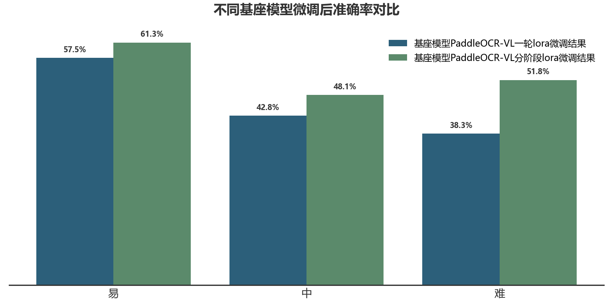

# 修正说明

之前用lora微调后得到的模型虽然能够理解一部分图片含义，但是对于有些图片依旧推理错误，导致整体准确率较低，具体表现为：
```text
1. JSON 输出不闭合，导致解析失败。
2. 模型幻觉生成大量额外 signal 行。
3. 模型把时间轴数字、MSB/LSB、bit-width 等注释误识别为信号名。
4. 模型把 wave 字符串错误放入 name 字段。
```

这些问题说明模型并非完全没有学习到波形特征，而是在结构化生成、干扰文字过滤和长序列停止方面不稳定。
因此为了解决这一问题，本次采用分阶段训练方法：
```text
Stage 1: 只输出 signal name，学习行结构和信号名
Stage 2: 使用 easy 样本学习完整 WaveDrom JSON
Stage 3: 加入 medium 样本进行训练
Stage 4: 使用全量样本 进行训练
```
该方法对应课程学习思想：先优化一个更简单、更平滑的问题，再逐渐过渡到完整复杂任务。
<div align="center">
  
</div>
测试结果表明之前简单的lora微调策略在评估集中测试有173个准确率为0的样本，使用分阶段训练微调策略在评估集中测试有84个准确率为0的样本，说明分阶段训练微调有较好的效果，显著提升了结构化生成稳定性以及抵抗生成幻觉的能力。
